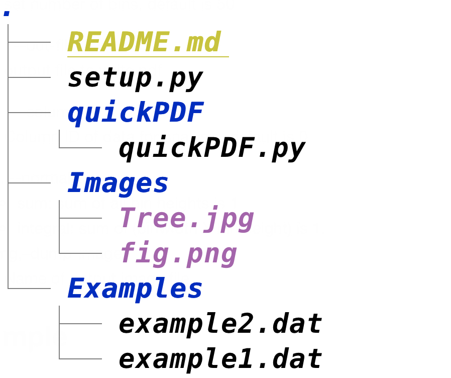
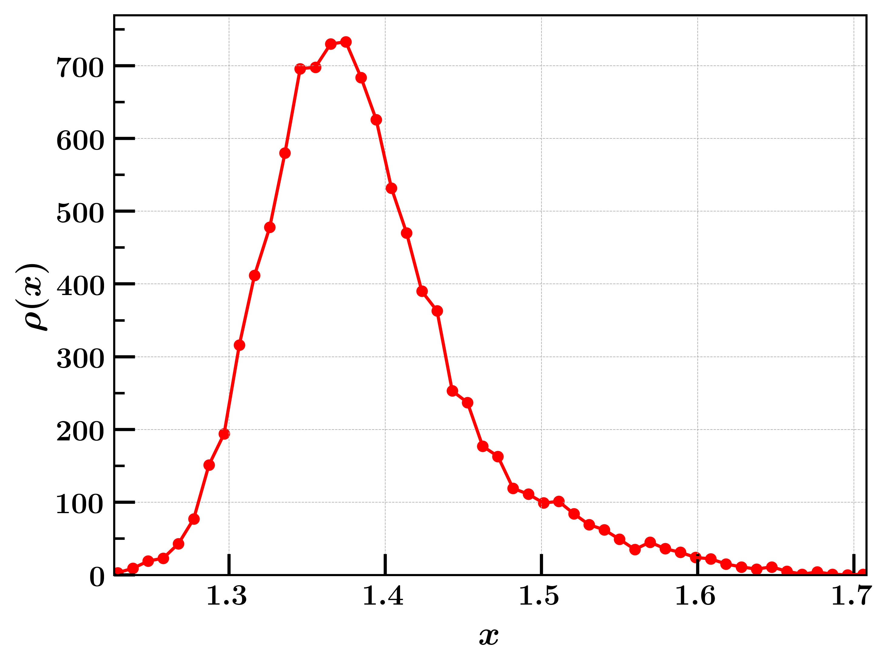

### quickPDF 
-----
This command line utility tool helps quick visualization of probability distribution 
of data from an ASCII file from terminal. 

### Code Organization
--- 
 

&nbsp;
&nbsp;

### Installation
---
```bash 
git clone https://github.com/masrul/quickPDF  
cd quickPDF 
pip install . 
```
&nbsp;
&nbsp;


### Usage
--- 
quickPDF [-h] [-nbins] [-o] [-c] [-n] [-img] file


positional arguments:   <br />
+ file 
    > Name of the input file (required)   <br />

optional arguments:   <br />
+  -h, --help          
    > show this help message and exit   <br />
+  -nbins              
    > set number of bins, default is 50   <br />
+  -o , --out-file     
    > output file to write pdf  <br />
+  -c , --column       
    > Column ID of data for analysis, default is 0
+  -n, --normalize     
    + sum: sum of all bin heights is 1
    + integral: sum of (binwidth X bin height) is 1.
+ -img,--dump-image            
    > Name of output image file  

### Examples
---
```bash 
quickPDF example1.dat  
quickPDF example2.dat --column 1 
```


### Copyright 
Masrul Huda (c) 2021
