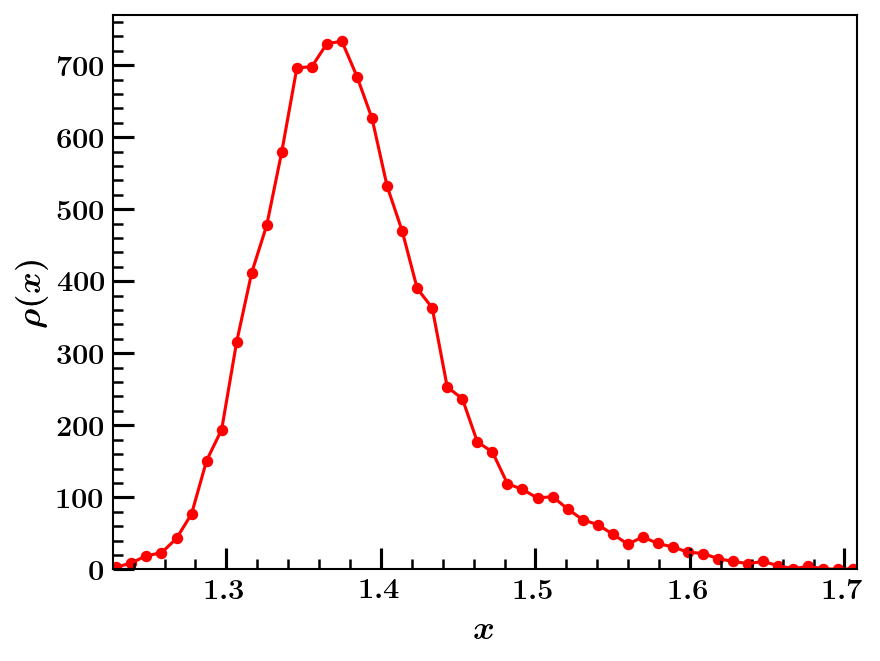

# quickPDF 

This command line utility tool helps quick visualization of probability distribution 
of data from a ASCII file.      

usage: quickPDF.py [-h] [-nbins] [-o] [-c] [-n] [-img] file

 

positional arguments:    
+ file 
    > Name of the input file (required)    

optional arguments:    
+  -h, --help          
    > show this help message and exit    
+  -nbins              
    > set number of bins, default is 50    
+  -o , --out-file     
    > output file to write pdf   
+  -c , --column       
    > Column ID of data for analysis, default is 0
+  -n, --normalize     
    + sum: sum of all bin heights is 1
    + integral: sum of (binwidth X bin height) is 1.
+ -img,--dump-image            
    > Name of output image file  

## Example

+ python quickPDF.py example1.dat  
+ python quickPDF.py example2.dat --column 1 

### Output 

